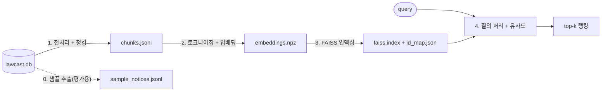

# LawCast Semantic Search

LawCast의 입법예고 데이터를 기반으로 구축하는 의미 검색 엔진 프로젝트입니다.

기존 검색은 SQLite FTS5 키워드 전문검색뿐이라 "세입자 보호" 같은 질의가 "임차인"이 들어간 법률안을
찾지 못합니다. 이 프로젝트는 그 위에 올릴 의미 검색 레이어입니다. 핵심 텍스트 소스는
`proposalReason`(제안이유 및 주요내용)으로, `제안이유` / `주요내용` 헤더와 `가. 나. 다.` 항목이
개행으로 구분된 구조화된 한국어 법률 텍스트입니다.

각 단계는 독립 실행 가능한 스크립트입니다. 앞 단계의 아티팩트를 다음 단계가 읽습니다.



(2)와 (4)는 동일 모델로 임베딩합니다. 청크 수·벡터·인덱스 용량 같은 아티팩트 규모는 코퍼스와 모델에
따라 달라집니다. 고정 수치가 아니라 산출 시점에 `/health.indexedChunks`나 아티팩트 파일에서 직접
확인하세요.

## 임베딩 모델 ([nlpai-lab/KURE-v1](https://huggingface.co/nlpai-lab/KURE-v1))

- **채택 근거**: 리트리벌(질의 → 문서 순위) 목적으로 학습되어 의미 검색과 목적이 일치하고
  홀드아웃 A/B에서 구어체·동의어 질의가 개선되며 제목/본문 평가셋 전 지표가 무회귀한 결과로
  채택했습니다. 긴 토큰 윈도우 덕분에 청크 절단도 발생하지 않습니다.
- **교체**: `LAWCAST_SEMANTIC_MODEL`로 다른 모델과 A/B할 수 있습니다 (예: `jhgan/ko-sbert-sts`,
  768차원 / 128 토큰). 모델을 바꾸면 인덱스도 함께 바뀌므로 1 → 3 전체 재구축이 필요하고
  증분 갱신은 모델 교체를 명시적 오류로 거부합니다.

## 디렉토리 구조

```
semantic-search/
├── lawcast_semantic/             # 파이프라인 라이브러리 (자체 완결, 루트 모듈 의존 없음)
│   ├── config.py                 #     설정·아티팩트 경로 단일 소유 (env: LAWCAST_SEMANTIC_*)
│   ├── datasource.py             # 0.  학습 데이터 소스: DB notice_archives.proposalReason (읽기 전용)
│   ├── preprocess.py             # 1a. 텍스트 정규화 + 섹션(제안이유/주요내용) 감지
│   ├── chunking.py               # 1b. 섹션 인식 청킹 (문장 경계 + 오버랩)
│   ├── embedding.py              # 2.  KoreanEmbedder: 토크나이징 + 임베딩 추출
│   ├── indexing.py               # 3.  VectorIndex: FAISS 생성/저장/로드/검색
│   ├── aliases.py                # 4a. 시민 약어 → 정식 법안명 질의 확장 (중처법, 산안법, ...)
│   ├── search.py                 # 4.  SemanticSearcher: 질의 처리 + 유사도 랭킹
│   ├── incremental.py            #     증분 갱신 (행별 출처 다이제스트 기반 재사용·복구)
│   ├── evaluation.py             #     검색 품질 지표 (notice_rank, recall@k / MRR)
│   └── omp_env.py                #     torch+faiss 공존 시 OMP 충돌 회피 (macOS)
├── scripts/                      # 독립 실행 CLI (각 단계)
│   ├── extract_sample_data.py    # 0.  LawCast DB에서 평가 코퍼스 샘플 추출
│   ├── 01_preprocess_chunk.py    # 1.  전처리 + 청킹
│   ├── 02_extract_embeddings.py  # 2.  토크나이징 + 임베딩
│   ├── 03_build_index.py         # 3.  FAISS 인덱싱 + 저장
│   ├── 04_search.py              # 4.  질의 + 유사도 검색
│   ├── 05_evaluate.py            #     정량 평가 (recall@k / MRR)
│   ├── 06_incremental_update.py  # 5.  증분 갱신 (신규/수정/삭제 공고만 반영)
│   └── benchmark_device.py       #     배치 처리량 cpu/mps 비교
├── data/                        # 평가셋·샘플 스냅샷 (git 추적)
│   ├── sample_notices.jsonl      # 평가 코퍼스 스냅샷
│   ├── eval_holdout_queries.jsonl # 홀드아웃 평가셋 (실사용자 스타일 질의)
│   └── eval_queries.jsonl        # 제목/본문 평가셋 (제목 컨텍스트 임베딩 회귀 검출)
├── artifacts/                    # 단계별 아티팩트 (gitignore, 코퍼스 규모에 비례)
│   ├── chunks.jsonl              #     stage 1 출력
│   ├── embeddings.npz            #     stage 2 출력
│   ├── faiss.index               #     stage 3 출력
│   ├── id_map.json               #     행 -> chunk_id 매핑
│   ├── .update.lock              #     증분 갱신 flock 락
│   └── backup-*/                 #     이전 세대 아티팩트 백업 (로컬 전용)
├── service/
│   ├── app.py                    # FastAPI 사이드카 (/health, /search, /reload)
│   └── update_runner.py          #     정기 갱신 틱 · 부트 리페어 실행기
├── tests/                        # pytest (모델 다운로드 없이 동작, sys.path은 conftest.py에서만)
│   └── fixtures/                 # 실제 공고 스냅샷 (내용 보존 가드 입력)
├── Dockerfile / .dockerignore    # 사이드카 이미지 (CPU torch, non-root) / 빌드 제외 대상
├── requirements.txt              # 로컬 .venv용 소스 의존성
├── requirements.lock             # pip freeze 고정본 (Docker 빌드, 재현 가능)
├── pyproject.toml                # 버전 단일 소유처 ([project].version) · 메타데이터 전용
├── ruff.toml                     # 린트·포맷 설정
└── .venv/                        # 로컬 가상환경 (직접 생성)
```

## 설치

```bash
cd semantic-search
python -m venv .venv          # Python 3.13 기준
.venv/bin/pip install -r requirements.txt
```

의존성 변경 후 테스트를 통과하면 `requirements.lock`을 재생성하세요 (Docker 이미지는 재현 가능한
빌드를 위해 lock에서 설치합니다):

```bash
.venv/bin/pip freeze > requirements.lock
```

임베딩 모델 가중치는 최초 실행 시 HuggingFace에서 자동 다운로드됩니다.

## 파이프라인 실행

각 스크립트는 어느 디렉토리에서든 실행 가능하며 (경로가 `lawcast_semantic/config.py` 기준 절대
해석), 이전 단계의 artifact를 기본 입력으로 읽습니다.

```bash
# 0. LawCast SQLite DB에서 평가 코퍼스 추출 (읽기 전용, 기본 소스: lawcast.db)
.venv/bin/python scripts/extract_sample_data.py --per-bucket 100   # 길이 구간별 건수

# 1. 전처리 + 청킹  -> artifacts/chunks.jsonl (JSONL 스냅샷 기준)
.venv/bin/python scripts/01_preprocess_chunk.py
#    또는 DB에서 직접 학습: notice_archives.proposalReason 전체를 청킹
.venv/bin/python scripts/01_preprocess_chunk.py --db lawcast.db

# 2. 토크나이징 + 임베딩 추출 -> artifacts/embeddings.npz
.venv/bin/python scripts/02_extract_embeddings.py

# 3. FAISS 인덱싱 + 저장 -> artifacts/faiss.index + id_map.json
.venv/bin/python scripts/03_build_index.py

# 4. 질의 처리 + 유사도 계산
.venv/bin/python scripts/04_search.py --query "국가 연구시설과 장비의 공동 활용" --k 3
.venv/bin/python scripts/04_search.py --query "..." --query "..." --json  # 다중 질의/JSON 출력

# 5. 증분 갱신: 신규/수정/삭제 공고만 반영 (전체 재구축 없이)
.venv/bin/python scripts/06_incremental_update.py --db lawcast.db
.venv/bin/python scripts/06_incremental_update.py --db lawcast.db --plan-only  # 변경 계획만 JSON으로
```

## 아티팩트 교체 규칙

`artifacts/`는 항상 **마지막에 완주한 파이프라인(0/1 → 3)의 아티팩트 한 세트**를 나타냅니다.

- **일관성 원칙**: 파이프라인을 다시 돌리면 chunks → embeddings → faiss/id_map이 한 세트로
  재생성됩니다. `embeddings.npz`가 보관하는 `chunks_fingerprint`(청크 id + 임베딩 입력의 해시)와
  `model_name`이 청크·모델과 자동 정합되므로 `SemanticSearcher.load`가 섞인 세트(예: 새 청크에
  옛 임베딩)를 ValueError로 거부합니다. **파일을 손으로 부분 교체하는 것은 항상 금지**이며
  일관된 세트를 만드는 방법은 두 가지입니다: 1 → 3 전체 재구축, 또는 증분 갱신.
- **증분 갱신(운영 권장)**: 신규·수정·삭제 공고만 반영하려면 `scripts/06_incremental_update.py`를
  사용합니다. 아티팩트은 전체 재구축과 동일하며 갱신 중 크래시는 재실행만으로 복구됩니다.
- **백업**: 이전 세대 아티팩트은 `artifacts/backup-*/`에 둡니다 (로컬 전용, gitignore). 이전 세대로
  되돌리려면 백업 파일을 `artifacts/` 최상위로 복사하거나, 스크립트의 `--chunks`, `--embeddings`,
  `--id-map` 인자로 백업 파일을 직접 지정하세요.
- **평가셋 주의**: `data/eval_*_queries.jsonl`의 정답 공고는 특정 코퍼스 기준으로 라벨링되어
  있습니다. 코퍼스를 바꾸면 주제 인접 공고가 다수 경합하므로 평가 지표는 **동일 코퍼스 안에서만**
  비교해야 하며 코퍼스가 달라지면 라벨링도 다시 해야 합니다.

## 백엔드 연동: HTTP 사이드카 (`service/app.py`)

LawCast 백엔드(NestJS)는 Python을 직접 임포트할 수 없으므로 이 프로젝트는 FastAPI 사이드카로
배포되고 백엔드는 HTTP로 호출합니다.

```bash
# 사이드카 실행 (semantic-search/ 디렉토리에서, 포트 8300)
.venv/bin/python -m uvicorn service.app:app --host 127.0.0.1 --port 8300

# 상태 확인 (엔진 로딩 중/실패/준비 완료를 status로 리포트)
curl http://127.0.0.1:8300/health

# 직접 검색
curl 'http://127.0.0.1:8300/search?query=임대차 계약에서 세입자 보호&k=3'
```

- `GET /health` → `{status: loading|ready|failed, model, indexedChunks, error}` + 갱신 관측 필드
  7종: `generation` (성공적 로드/스왑마다 증가), `reloadError`, `lastUpdateAt`,
  `lastUpdateResult` (`changed|unchanged|failed|skipped`), `lastUpdateError`,
  `lastUpdateTriggeredAt` (가장 최근 틱의 트리거 시각, UTC ISO 8601 · 재시작 시 `null`),
  `updating` (틱 진행 중 여부 — 긴 틱도 실행 중에 확인 가능). 추가 계약이며 기존
  소비자는 `status`만 읽습니다.
  - `lastUpdateAt`은 **서빙 중인 세대의 인덱스 마지막 기록 시각**입니다: 모든 아티팩트 작성 경로
    (호스트 03/06, 사이드카 틱·부트 리페어)가 수렴하는 `VectorIndex.save`가 `id_map.json`의
    `updated_at`(UTC ISO 8601)로 스탬프하고, 엔진 로드/스왑 시 그 값을 채택합니다. 따라서
    재시작 후에도 유지되며 틱 결과(`unchanged`/`failed`)와 무관하게 움직이지 않습니다.
    스탬프 이전의 레거시 아티팩트은 `null`을 보고합니다 (첫 기록 시까지).
  - `lastUpdateResult`/`lastUpdateError`는 **마지막 틱의 결과**이며 재시작 시 `null`입니다.
- `GET /search?query=&k=` → 청크 랭킹 결과. query 1~500자 (공백만은 400), k 1~200 (기본 5).
  응답에 `lastUpdateAt`(서빙 세대의 인덱스 마지막 기록 시각, `str|null`)이 실려 있어 백엔드가
  검색 요청 한 번으로 시각을 함께 받습니다 — `SearchResponse`와 백엔드의
  `SemanticSidecarSearchResponse`를 필드 단위로 고정하는 크로스 언어 계약 테스트
  (`backend/src/modules/semantic-search/semantic-search.contract.spec.ts`)가 양쪽을 묶습니다.
  **k의 단위는 청크**입니다: 백엔드는 chunk → 공고 중복 제거 후에도 공고 k개를 채우기 위해 청크를
  과요청하며 k 상한(`MAX_K`)은
  `backend/src/modules/semantic-search/semantic-search.contract.spec.ts`가 양쪽 계약과 함께
  고정합니다. **결과 계층**: 코사인 유사도 ≥ `CLEAR_SIMILARITY`(기본 0.45)는 `results`(명확한
  결과), 그 아래 ~ `MIN_SIMILARITY`(기본 0.25)는 `weakResults`(약한 관련 결과 — 프런트엔드는
  빈 결과 화면의 버튼으로만 표시), 0.25 미만은 무관하여 응답에서 아예 제외됩니다. 명확한 결과가
  없으면 `results`가 빈 배열로 반환됩니다. 임계값은 `LAWCAST_SEMANTIC_MIN_SIMILARITY` /
  `LAWCAST_SEMANTIC_CLEAR_SIMILARITY`로 조정합니다 (둘 사이 관계 검증 포함). 엔진 로딩 중/로딩
  실패 시 503 + 사유. 모델은 시작 시 백그라운드에서 1회 로딩되며
  요청을 블로킹하지 않고 로딩 실패는 프로세스 재시작 전까지 유지됩니다.
- 백엔드 설정: `SEMANTIC_SEARCH_ENABLED` / `SEMANTIC_SEARCH_API_URL` (기본
  `http://127.0.0.1:8300`) / `SEMANTIC_SEARCH_TIMEOUT` (기본 10초). 루트 `docker-compose.yml`에서
  백엔드 컨테이너는 `SEMANTIC_SEARCH_API_URL=http://semantic-search:8300`로 오버라이드되어
  사이드카 컨테이너에 도달합니다.

## Docker 배포

루트 `docker-compose.yml`의 `semantic-search` 서비스로 배포됩니다 (이미지 빌드는 `Dockerfile`,
빼는 대상은 `.dockerignore`가 단일 소유):

```bash
docker compose up -d --build semantic-search   # 루트에서
curl http://127.0.0.1:8300/health              # 상태 확인 (호스트 디버깅용)
```

- **이미지는 코드만 담습니다**: 인덱스 아티팩트 (gitignore)은 호스트의
  `semantic-search/artifacts/`를 `/app/artifacts`에 바인드 마운트하고 모델 가중치는
  `lawcast_semantic_hf_cache` 볼륨 (`HF_HOME=/cache/huggingface`)에 1회 다운로드됩니다. 아티팩트
  위치는 `LAWCAST_SEMANTIC_ARTIFACTS_DIR`로 지정할 수 있습니다.
- **인덱스 준비는 배포 전제 조건입니다**: 파이프라인 (1 → 3) 또는 증분 갱신으로 `artifacts/`
  세트를 만든 뒤 컨테이너를 기동하세요. 빈 아티팩트이면 `/health`가 `failed`를 보고합니다.
- **헬스체크**: compose가 소유하며 엔진 로드 실패 (`status: failed`)에서만 unhealthy입니다. 최초
  기동의 모델 다운로드/로딩 (`loading`)은 healthy로 봅니다 (백엔드가 키워드로 폴백).
- **동작 계약**: 콜드 캐시 최초 기동은 모델 다운로드가 끝날 때까지 `loading`이며 그 전에는
  `ready`가 아닙니다 (캐시 볼륨이 있으면 재배포는 로딩만). 로드 실패는 `failed`로 유지되고 자동
  재시도가 없으므로 원인 수정 후 아티팩트을 재생성해야 합니다 (같은 환경에서는 재시작만으로는
  복구되지 않습니다).
- **torch는 CPU 휠로 설치합니다** (`download.pytorch.org/whl/cpu`): PyPI 기본 linux 휠은 사용하지 않는 CUDA 의존성 수 GB를 끌어옵니다.
- **증분 갱신 반영**: `scripts/06_incremental_update.py`가 아티팩트를 갱신하면 사이드카가 자동
  반영합니다 — 스케줄 틱이 디스크 지문과 서빙 세대를 비교해 load-validate-swap하고 (지문 일치 시
  재로드 생략), 수동으로는 `POST /reload`로 즉시 스왑합니다. 아티팩트를 직접 쓰는 호스트 작업은 아래 flock 규칙을 지켜야 합니다.

| env                                   | 기본값      | 의미                                                                                                               |
| ------------------------------------- | ----------- | ------------------------------------------------------------------------------------------------------------------ |
| `LAWCAST_SEMANTIC_DB_PATH`            | _(빈값)_    | 갱신 소스 DB 경로. **빈값 = 스케줄·부트 리페어 끔**                                                                |
| `LAWCAST_SEMANTIC_UPDATE_CRON`        | `0 * * * *` | 갱신 크론 식(분 시 일 월 요일, 로컬시간 — 컨테이너 `TZ`). **빈값 = 스케줄 끔** (구 `UPDATE_INTERVAL_MINUTES` 대체) |
| `LAWCAST_SEMANTIC_ALLOW_LARGE_DELETE` | off         | 삭제 가드 무효화 (`1`/`true`/`yes`/`on`만 인식, 대소문자·공백 무시)                                                |

- **`.env` 파일**: `lawcast_semantic/config.py`가 임포트 시 프로젝트 루트의 `.env`를 읽습니다
  (`LAWCAST_SEMANTIC_ENV_FILE`로 경로 지정, **빈값 = 파일 읽기 끔**). 프로세스 환경(compose
  `environment:`, 셸 export)이 파일보다 항상 우선하며, docker-compose는 `env_file:`로
  컨테이너에 런타임 주입합니다 (파일 부재 시에도 `required:false`로 통과, 이미지에는 미포함).
  템플릿은 `semantic-search/.env.example` 참조.
- **틱** (사이드카 lifespan 스레드 = 인프로세스 크론잡): `UPDATE_CRON` 식이 다음 발생 시각을
  계산해 그때까지 대기 후 1회 실행 — 주기 ±10% 지터 대신 크론이 정확한 분을 고정합니다. 흐름은
  DB 읽기 (`mode=ro`) → 증분 plan → 삭제 가드 (삭제 >100건 **그리고** >20%면 거부) → 원자적 쓰기 →
  load-validate-swap. 엔진이 `ready`일 때만 돌고 `failed`면 루프를 멈춥니다. 잘못된 크론 식은
  ERROR 로그 후 스케줄만 끕니다 (서빙은 그대로). 틱의 트리거·결과는 각각
  `update tick triggered` / `update tick finished: <result>` INFO 로그로 사이드카 로그에 남고,
  결과는 `/health.lastUpdateResult`로 관측됩니다. `unchanged`가 아닌 결과는 공고 추가/수정/삭제
  수, 청크·임베딩 수, 소요 시간, 실패 사유를 담은 `index update: ...` 상세 INFO 로그가 한 줄 더
  남습니다 (`unchanged` 틱은 조용히 두 줄만).
- **`POST /reload`** (내부 네트워크, 무인증) — 디스크 아티팩트를 즉시 스왑: `200` (health 본문,
  generation 증가) / `409` (엔진 미준비, 또는 갱신 진행 중 —
  `an index update is already in progress`) / `503` (새 세대 검증 실패, 이전 세대가 계속 서빙,
  사유는 `reloadError`).
- **flock 규칙 (호스트 수동 실행)**: 스케줄 틱은 아티팩트 디렉터리의 `.update.lock`을 flock으로
  잡고 실행하며 점유 중이면 다른 틱/수동 실행과 겹치지 않습니다 (`lastUpdateResult=skipped`).
  `06_incremental_update.py` 자체는 이 lock을 잡지 않으므로 수동 실행 시
  `flock semantic-search/artifacts/.update.lock -c '...'`로 감싸세요 (Linux). macOS에는
  `flock(1)`이 없으니 실행 중 스케줄을 끈 뒤 (`DB_PATH` 미설정) 실행하세요.

## 라이브러리 구조 및 데이터 흐름

`lawcast_semantic/`는 자체 완결적인 라이브러리입니다. 백엔드 연동 시 아래처럼 임포트해 사용합니다.
설정·아티팩트 경로는 `lawcast_semantic/config.py`가 단일 소유이며 루트 레벨 설정 모듈은 없습니다.

```python
from lawcast_semantic import KoreanEmbedder, SemanticSearcher  # 공개 API (지연 로딩)

embedder = KoreanEmbedder()  # 기본값: config.MODEL_NAME / config.DEVICE
searcher = SemanticSearcher.load(embedder)  # 기본 경로: config의 artifacts/*
results = searcher.search('세입자 보호', k=5)  # 아티팩트 지문/모델 불일치 시 ValueError
results = searcher.search('중처법', k=5)  # 약어는 자동으로 정식 법안명으로 확장됨

expand_query('산안법 개정')  # QueryExpansion(text='산업안전보건법 개정', matched=('산안법',))
```

- **책임 분리**: `datasource`(데이터) / `preprocess`·`chunking`(전처리·청킹) / `embedding`(엔진) /
  `indexing`(인덱스) / `aliases`(질의 약어 확장) / `search`(조회) / `evaluation`(지표) /
  `incremental`(갱신) / `config`(설정) — 단방향 의존 DAG (`config` ← 각 모듈 ← `search`), 순환 없음.
- **상태 소유**: 공고 레코드 스키마·JSONL은 `datasource`, 청크 레코드 스키마·JSONL·지문은
  `chunking`, 모델 런타임은 `KoreanEmbedder`, 인덱스 런타임은 `VectorIndex`, 로드된 조회 상태
  (artifact 검증 포함)는 `SemanticSearcher`가 소유합니다.
- **CLI/라이브러리 분리**: `scripts/`는 argparse·출력(프레젠테이션)만 담당하고 라이브러리는 CLI를
  모릅니다. `__init__`의 공개 API는 PEP 562 지연 로딩이라 가벼운 모듈 (`datasource` 등) 임포트가
  torch/faiss를 로드하지 않습니다 (테스트로 고정).
- **데이터 흐름**: `datasource` → `preprocess`/`chunking` → `embedding` → `indexing` → `search`.
  질의는 `search` → `aliases.expand_query` → `normalize_text` → `embed_query` → FAISS top-k.

## 단계별 상세

### Stage 0 — 학습 데이터 소스 (`datasource.py`)

- 학습 코퍼스의 단일 원천은 DB `notice_archives.proposalReason` 컬럼입니다. `source_html`
  스냅샷은 일절 읽지 않으며 HTML에서 텍스트를 추출하지 않습니다.
- `load_notices_from_db`: DB에서 공고 레코드를 직접 로드 (`--db` 학습 경로)
- `extract_sample`: `proposalReason` 길이 구간별 샘플링 (스트래티파이드)
- `load_notices_jsonl` / `write_notices_jsonl`: 동일 레코드의 JSONL 스냅샷 입출력 (오프라인 재현용)
- 전처리(정규화)는 `preprocess.py`의 책임이며 HTML 태그 제거는 잔여 마크업 가드일 뿐입니다.

### Stage 1 — 전처리 및 청킹

- **전처리** (`preprocess.py`): NFC 정규화, 잔여 마크업/제로폭 문자 제거, 가로 공백 정리. 개행은
  보존합니다. `proposalReason`의 줄바꿈은 문단 구조이며 의미를 가집니다. `normalize_text`는 질의
  경로와 공유되므로 텍스트를 삭제하는 변환을 넣지 않습니다(아래 보일러플레이트 제거는 인덱싱 전용).
- **섹션 감지**: `제안이유`, `제안이유 및 주요내용`, `주요내용`, `참고사항` 등 헤더로 섹션을
  나눕니다. 헤더는 **줄 전체가 아니라 줄 접두**로 인식합니다 — 코퍼스는
  `제안이유 및 주요내용 현행법은 ...`처럼 라벨을 본문 첫 문단에 붙여 쓰는 쪽이 훨씬 흔하고,
  줄 전체만 인정하면 그 라벨이 임베딩 입력에 그대로 남습니다. `대안의 제안이유` 같은 한정어와
  `【제안이유】` 괄호 형태도 같은 라벨로 보고, 라벨 뒤에는 공백이나 줄 끝이 와야 하므로
  `주요 내용은 ...`처럼 우연히 같은 글자로 시작하는 본문 문장은 건드리지 않습니다.
- **보일러플레이트 제거** (인덱싱 전용): 섹션 라벨은 청크의 `section` 메타데이터로만 남기고 본문에서
  빼며, 열거자(`가.`, `나)`, `①`, `ㅇ`)는 줄 머리와 문장 뒤에서 제거합니다. 둘 다 코퍼스 전역
  상수라 임베딩에 넣으면 모든 청크가 서로 닮아지고 토큰만 소모합니다. 실측(3,000 공고):
  라벨을 품은 청크 1,059 → 66, 열거자로 시작하는 청크 1,921 → 10, 청크 수 −0.93%, 토큰 −1.04%.
  두 제거 함수는 인덱싱 경로에만 적용됩니다 — 질의에 적용하면 사용자가 입력한 텍스트를 임의로
  지우게 됩니다.
- **청킹** (`chunking.py`):
  1. 섹션별 문단을 문장 경계 (`.!?`, 개행) 기준 유닛으로 분할
  2. 유닛을 청크로 그리디 패킹 (개행으로 결합해 문단 구조 유지). 상한 200자는 **임베딩 입력
     (제목+본문) 전체** 기준이며 본문 예산은 제목 길이만큼 자동 축소됩니다.
  3. 청크 경계에 이전 청크의 꼬리 (~50자)를 오버랩해 문맥 손실 방지
  4. **하한 40자 미만 청크는 앞 청크에 병합**합니다. 하한 미만은 옆에 끼지 못한 잔여물(예산보다
     긴 문장을 강제 분할한 꼬리, 꽉 찬 청크 뒤의 마지막 문단)이고 **내용**이므로, 예전처럼 버리면
     그 텍스트는 어떤 질의로도 검색되지 않습니다. 병합은 캐리 중복분을 제외한 신규 유닛만 붙이므로
     청크 id·index가 그대로 유지되고(재임베딩은 바뀐 텍스트만), 예산 초과는 병합에서만 최대
     40자(`CHUNK_MAX_CHARS + CHUNK_MIN_CHARS`)입니다. 실측(전량 코퍼스): 내용 손실 4,434유닛 → 0,
     청크 +0.09%, 최장 임베딩 입력 240자 = 158토큰(윈도우 8192, 절단 0).
  5. `proposal_reason`가 빈 공고는 제목 기반 단일 청크로 폴백 (모든 공고가 검색 가능)
- 청크 스키마: `chunk_id`, `notice_num`, `subject`, `committee`, `section`, `chunk_index`, `text`,
  `char_count`, `sentence_count`

### Stage 2 — 토크나이징 + 임베딩 추출

- `KoreanEmbedder`가 설정된 모델 (기본 `nlpai-lab/KURE-v1`)을 sentence-transformers로 로드합니다.
  디바이스·배치는 `LAWCAST_SEMANTIC_DEVICE` (기본 `cpu`) / `LAWCAST_SEMANTIC_BATCH`로 조절하세요.
- **임베딩 입력 구성**: 공고 제목을 컨텍스트 프리픽스로 결합합니다 (`"{제목}\n{본문}"`). 제목에만
  등장하는 어휘 (예: "공급망 안정화")가 벡터에 반영되어 제목 어휘 질의가 매칭됩니다.
  (`compose_embedding_text`가 단일 소스이며 청크 지문도 동일 입력 기준으로 해싱)
- **토크나이징 단계**: 이 결합 입력을 모델 토크나이저로 변환해 토큰 수/절단 여부를 리포트하고
  모델 윈도우를 넘는 청크를 가드레일로 출력합니다. `truncated_count`가 0이 아니면 청크 상한이나
  모델을 재조정하세요.
- **임베딩 추출**: float32, L2 정규화 (코사인 유사도용). 청크 상한 200자는 이전 모델의 짧은 토큰
  윈도우용 캘리브레이션이지만 청크 크기 정책으로 그대로 유지합니다 (비교 가능성).

### Stage 3 — FAISS 인덱싱 및 저장

- `faiss.IndexFlatIP` + L2 정규화 벡터 = 코사인 유사도 (정밀 탐색).
- 현재 코퍼스 규모 (수만 청크)에서는 정밀 탐색이 충분하며 대규모화 시 IVF/PQ로 교체 가능합니다.
- `faiss.index` (바이너리)와 `id_map.json` (행 → chunk_id)을 함께 저장해 청크 메타데이터와 연결.

### Stage 4 — 질의 처리 + 유사도 계산

- **시민 약어 확장** (`aliases.expand_query`, stage 4a): 시민이 쓰는 음절 약어·축약명을 정식
  법안명으로 바꿔 임베딩합니다. `중처법`·`산안법`·`전상법` 같은 표면형은 코퍼스
  (`proposalReason`/`subject`)에 존재하지 않아 확장 없이는 검색이 비거나 유사 명칭으로
  흘러갔습니다. **인덱스는 건드리지 않습니다** — 질의 벡터를 코퍼스가 실제로 가진 정식명 쪽으로
  옮기는 방식이라 재임베딩도 아티팩트 교체도 불필요합니다. 표는 `aliases.ALIASES`가 단일
  소유이며, 각 정식명은 `notice_archives.subject`에 실재하는 이름이어야 합니다.
  별칭은 단독으로 쓰일 때만 확장되고(`중처법상` O, `중처법률` X), 뒤따르는 조사
  (은/는/이/가/을/를/의/에/도/만/상/로/과/와/에서/으로)는 보존됩니다.
  적용 범위: `SemanticSearcher.search()` → 사이드카 `/search` → 백엔드, `scripts/04_search.py`,
  `scripts/05_evaluate.py`, 그리고 `embedding-map` 추적 UI까지 같은 경로를 씁니다.
- 질의도 문서와 동일한 정규화 (`normalize_text`)를 거쳐 동일 모델로 임베딩합니다 (도메인
  일관성). 질의에는 공고 제목이 없으므로 질의 텍스트를 그대로 임베딩하고 제목 컨텍스트는 청크
  측에서 제공합니다.
- FAISS top-k 탐색 후 코사인 유사도 점수와 청크 메타데이터 (공고 번호, 제목, 섹션, 원문 발췌)를
  랭킹 출력합니다.
- **관련도 계층화** (`SemanticSearcher.search_tiered`): 상위 k개 창을
  `CLEAR_SIMILARITY` 이상 = 명확한 결과 (`results`), `MIN_SIMILARITY` 이상 = 약한 결과
  (`weak_results`, 별도 전달), 미만 = 무관 (제외)으로 분리합니다. 두 임계값은
  `LAWCAST_SEMANTIC_MIN_SIMILARITY` (기본 0.25) / `LAWCAST_SEMANTIC_CLEAR_SIMILARITY`
  (기본 0.45)로 조정하며, 사이드카 `/search`는 이 계층을 `results` / `weakResults`로 그대로
  전달합니다. 원 랭킹이 필요한 CLI·평가 도구는 `search()`를 그대로 사용합니다.

### Stage 4a — 시민 약어 사전 편집 기준 (`aliases.ALIASES`)

`aliases.ALIASES`는 수동 큐레이션 표입니다. 항목을 넣고 뺄 때는 아래 기준을 따릅니다.

**1. 정식명은 코퍼스에 실재해야 한다.** 확장은 질의 벡터를 코퍼스가 저장한 표면형으로 옮기는
방식이므로, 값은 `notice_archives.subject`에 존재하는 법안명이어야 합니다. 없는 이름은 항목이
없는 것보다 나쁩니다(멀쩡한 질의를 엉뚱한 곳으로 보냅니다).

```bash
cd backend
sqlite3 'file:lawcast.db?mode=ro' \
  "SELECT COUNT(*) FROM notice_archives WHERE subject LIKE '<정식 법안명>%';"   # 0이면 쓸 수 없다
```

**2. 모든 항목은 실측으로 정당화한다.** 실패를 고치거나 최소한 중립일 때만 넣고, 원래 rank 1이던
결과를 rank 1이 아니게 만들면 제거합니다 — `스토킹처벌법`이 확장 후 1 → 2로 나빠져 삭제됐고, 그
이유는 `aliases.py` 주석에 남아 있습니다. 단독형과 문장형(예: `중처법`, `중처법 개정 논의`)을 모두
측정해 **회귀 0건**일 때만 유지합니다.

**3. 인덱스는 건드리지 않는다.** 질의측 변환이므로 항목 추가·삭제에 재임베딩이나 아티팩트 교체가
필요하지 않습니다. 표 수정에 `scripts/02`·`scripts/03`을 다시 돌려야 한다면 설계가 어긋난 것입니다.

**4. 경계·조사·표기 변형은 항목으로 만들지 않는다.** 약어는 단독으로 쓰일 때만 확장되고
(`중처법상` O, `중처법률` X) 뒤따르는 조사(은/는/이/가/을/를/의/에/도/만/상/로/과/와/에서/으로)는
보존됩니다. 공백 유무(`AI 기본법` / `AI기본법`)와 라틴 문자 대소문자도 자동 처리되므로 이들을 위한
중복 항목을 추가하지 마세요.

**5. 약어로 풀 수 없는 것은 넣지 않는다.** 질의가 이미 정식명인 근접 명칭 경합(`지방의회법` vs
`지방자치법`)은 순위 문제이지 약어 문제가 아닙니다.

**6. 변경 시 검증** (하나라도 실패하면 사전을 되돌립니다).

```bash
cd semantic-search
.venv/bin/ruff check . && .venv/bin/ruff format --check .   # 린트·포맷
.venv/bin/python -m pytest tests/ -q                       # 전체 suite (사전 무결성 포함)
.venv/bin/python scripts/05_evaluate.py                    # 회귀 게이트 — 수치가 변하면 회귀
.venv/bin/python scripts/04_search.py --query '<약어>'      # 단독형 표현별 순위 확인
```

단독형·문장형 순위를 before/after로 재측정해 회귀 0건을 확인합니다. `05_evaluate.py`의 절대 수치는
코퍼스에 종속적이므로 **변경 전후 델타**만 의미가 있습니다.

**7. 사전은 낡는 자산이다.** 코퍼스가 바뀌거나 시민 표현이 달라지면 재검증이 필요합니다. 새 약어
실패를 발견하면 먼저 그 실패를 순위로 정량화한 뒤 항목을 추가하세요 — 실패를 재현하지 않는 항목은
기준 2를 통과할 수 없습니다.

## 실행 결과 예시

```
query: 버스회사를 인수한 사모펀드가 차고지를 팔면
  1. score=... notice=2221504 [body] 여객자동차 운수사업법 일부개정법률안 (김남근의원 등 13인)
     버스회사를 인수한 사모펀드의 투자전략계획서 분석 자료에 의하면 버스회사를 인수한 사모펀드들은
     차고지를 매각하여 고배당을 하고 엑시트(투자금회수)...
  2. score=... notice=2221504 [body] 여객자동차 운수사업법 일부개정법률안 (김남근의원 등 13인)
     영업이익 이상의 과도한 배당을 위한 자금 마련을 위해 자본잉여금을 배당가능한 이익잉여금으로...
```

구어체 질의 ("차고지를 팔면")가 공고 본문의 법률 서술 ("차고지 매각")과 매칭되어 정답 공고가
상위를 채우는 모습입니다. 키워드 검색 (FTS5)과 차별화되는 의미 검색의 동작이며 점수 값은
코퍼스·모델에 따라 달라집니다.

## 정량 평가 (recall@k / MRR)

검색 품질을 숫자로 측정합니다. 측정은 공고 단위입니다: 청크 랭킹에서 공고별 첫 등장 순위로 중복
제거 후 계산합니다 (`recall@k` = 정답 공고가 상위 k개 공고 안에 있는 비율, `MRR` = 첫 등장 순위
역수의 평균).

| 평가셋    | 파일                                                               | 용도                                                    |
| --------- | ------------------------------------------------------------------ | ------------------------------------------------------- |
| 홀드아웃  | [data/eval_holdout_queries.jsonl](data/eval_holdout_queries.jsonl) | 대규모 코퍼스 실사용 품질 측정 (주 평가셋)              |
| 제목/본문 | [data/eval_queries.jsonl](data/eval_queries.jsonl)                 | 제목 컨텍스트 임베딩 회귀 검출 (`key_phrase` 분류 검증) |

**홀드아웃 평가셋 작성 원칙**: 코퍼스 문구 유도가 아닌 실제 사용자 표현을 씁니다.

- **abbr**: 법안명 약칭 — "예보법 개정", "보이스피싱 특별법" 등
- **colloquial**: 일상 질문 — "해외직구할 때 관세 얼마나 내야 해?" 등
- **synonym**: 동의어·일상어 — "디자인 특허" (디자인보호법), "자영업자" (소상공인) 등
- 정답은 단일 공고이며 동일 법안 복수 개정안이 경합하면 개정 내용으로 질의를 구별합니다. 각 쌍에
  `intent`로 근거를 기록합니다.

### 측정 원칙

- **코퍼스를 고정한 채로만 비교하세요.** 동일 평가셋이라도 코퍼스가 바뀌면 정답 주변 경합이 달라져
  지표가 크게 변동하므로 샘플 코퍼스 지표와 전체 코퍼스 지표를 직접 비교해서는 안 됩니다.
- 평가셋의 정답 라벨은 특정 코퍼스 기준이므로 코퍼스를 바꾸면 라벨링을 다시 해야 합니다.
- `data/sample_notices.jsonl`이 측정 기준 스냅샷이며 재추출하면 DB 갱신으로 달라질 수 있습니다.
- 절대 품질 척도가 아니라 **회귀 검출용**입니다.

```bash
.venv/bin/python scripts/05_evaluate.py --eval data/eval_holdout_queries.jsonl  # 홀드아웃
.venv/bin/python scripts/05_evaluate.py                                        # 제목/본문 세트
```

## 린트 / 포맷

ruff로 코드 품질을 관리합니다 ([ruff.toml](ruff.toml): E/F/W/I/UP 규칙, 100자, single quote).

```bash
.venv/bin/ruff check --fix . && .venv/bin/ruff format .    # 자동 수정 + 포맷
.venv/bin/ruff check . && .venv/bin/ruff format --check .  # 통과 검증
```

## 테스트

```bash
.venv/bin/python -m pytest tests/ -q    # 전체 suite — 현재 241 passed, 1 skipped, ruff clean
```

- `test_aliases.py` — 약어 확장 (표 무결성, 단독/조사 경계, 다중·중복 약어, 대소문자·공백 변형,
  빈 질의, 그리고 `search()`가 확장된 텍스트를 임베딩하는지 배선 검증)
- `test_preprocess.py` — 정규화 (개행 보존, NFC, HTML 제거), 섹션 감지, 헤더 접두 인식
  (붙은 라벨·`대안의` 한정어·괄호, 본문 문장 오탐 방지), 열거자/접두 라벨 제거
- `test_datasource.py` — DB `proposalReason` 로드 (`source_html` 무시 증명), 길이 구간 샘플링, JSONL
  스냅샷 라운드트립
- `test_chunking.py` — 청크 크기 상한 (제목 컨텍스트 예산 포함), 오버랩, 섹션 전파, chunk_id 유일성,
  중복 notice_num 거부, 폴백, 제목 컨텍스트 결합 (`compose_embedding_text`), 청크 텍스트에
  라벨·열거자가 남지 않으면서 본문은 보존되는지
- `test_chunk_coverage.py` — **내용 보존 회귀 가드**: 청킹이 문단 텍스트를 인덱스에서 조용히
  빠뜨리지 않는지 검증합니다. 커밋된 실제 공고 픽스처(`tests/fixtures/notices-chunk-coverage.jsonl`,
  11건 — 하한 필터가 내용을 버렸던 공고, 그 중 가장 짧은/긴 조각, 중간에서 사라진 조각, 섹션이
  통째로 사라진 공고, 무영향 대조군 3건)와 예산 경계마다 잔여물을 만드는 합성 형태 9종 × 예산 조합
  3종을 돌립니다. 오라클은 원문에서 다시 유도하므로(공백 무시 매칭) 패킹 변경이 스스로 만족시킬 수
  없습니다. 코퍼스가 있는 호스트에서는 최신 2,000공고 전수 스윕도 함께 돌고, CI에는 `lawcast.db`가
  없어 픽스처만 실행됩니다
- `test_chunk_coverage_retrieval.py` — **검색 계층 가드**: 하한이 버린 조항이 인덱스에 *들어갔는지*가
  아니라 **질의로 도달되는지**를 검증합니다. 조항별 질의(그 조항이 속한 문장)로 `/search` 기본
  창(`DEFAULT_K=5`)을 조회해, 그 조항을 담은 청크가 **그 조항의 공고** 안에서 창에 들어오고 첫 번째
  서로 다른 공고가 그 공고임을 단정합니다. 랭킹·조인은 실제 `SemanticSearcher`가 하지만 **서브프로세스
  프로브**(`tests/retrieval_probe.py`, 결정적 해싱 n-gram 임베더 — 모델·다운로드 없음)에서 돌립니다:
  한 프로세스가 faiss 검색을 먼저 하고 torch를 나중에 임포트하면 libomp 이중 초기화로 abort하므로
  (`lawcast_semantic/omp_env.py` 참조), pytest 프로세스는 두 엔진을 건드리지 않습니다. 모델 캐시·
  코퍼스·최신 아티팩트가 있는 호스트에서는 `scripts/05_evaluate.py`로 실모델 검증(모든 조항의 공고가
  첫 페이지 안에 노출, `SURFACE_BOUND=10`)을 실행하고, 라이브 인덱스가 병합 이전이면 그 검사만 정직하게
  skip합니다. recall@1은 단정하지 않습니다 — 재구축된 라이브 인덱스에서 10/11 조항이 1위, 나머지 1건은
  병행 법안군과 동일한 회계 보일러플레이트 문장이라 8위(메모리 22 §7 측정치)
- `test_indexing_search.py` — FAISS 저장/로드 라운드트립, 랭킹 결정성 (동점 tie-break), 아티팩트
  지문·모델 불일치 거부 (스텁 임베더로 모델 다운로드 없이 실행)
- `test_evaluation.py` — recall@k/MRR 계산, 공고 중복 제거 순위, 평가셋 무결성
- `test_entrypoints.py` — 실제 스크립트 실행: 빈 입력·빈 공고·DB 직접 학습 (`--db`)·잘못된 `--k`·
  빈 평가셋·경량 임포트 시 모델 스택 미로딩·아티팩트 불일치의 깔끔한 error 표기 (트레이스백 없음)
- `test_incremental.py` — 증분 갱신 (행별 출처 다이제스트, 재사용·크래시 복구)
- `test_config.py` / `test_update_runner.py` / `test_service.py` — env 게이트, 스케줄·부트
  리페어·스왑/롤백 계약, `POST /reload` 경계와 로딩 단계 분리
- `test_concurrency.py` — HTTP 사이드카 동시성 5종 (서버 라이프사이클·동시 발사 하니스는
  `tests/conftest.py`에 공유. 상세는 아래 "동시성 테스트" 참조)
- `test_version.py` — `pyproject.toml` 버전 형식(semver)·필수 메타데이터·메타데이터 전용 계약

### 동시성 테스트 (`test_concurrency.py`)

사이드카(`service/app.py`)의 동기 핸들러가 요청 뒤에 블로킹 없이 겹쳐 실행됨을 증명하는 5종
테스트입니다. 인프로세스 uvicorn(스럽) / 실엔진 서브프로세스(프로덕션 Dockerfile CMD) 라이프사이클,
준비 대기, 동시 발사 하니스는 `tests/conftest.py`에 있습니다.

```bash
.venv/bin/python -m pytest tests/test_concurrency.py -q      # 동시성 5종만
.venv/bin/python -m pytest tests/test_concurrency.py -q -s   # 측정 프린트 (타이밍·마진·GIL 분리)
.venv/bin/python -m pytest tests/test_concurrency.py -q -k real   # 실엔진 1종만 (~10초)

# CI·클린 클론 경로 확인: 아티팩트/모델 캐시 없음 → 실엔진 테스트 자동 skip
LAWCAST_SEMANTIC_ARTIFACTS_DIR=$(mktemp -d) .venv/bin/python -m pytest tests/test_concurrency.py -q
#   → 4 passed, 1 skipped
```

| 테스트                                             | 증명하는 것                                                          | 핵심 실측                                             |
| -------------------------------------------------- | -------------------------------------------------------------------- | ----------------------------------------------------- |
| `concurrent_searches_overlap_and_all_succeed`      | 8개 동시 `/search`가 큐 대기 없이 겹침                               | `max_in_flight=8`, wall 0.42s vs 직렬화 예산 3.20s    |
| `health_responds_fast_while_slow_search_runs`      | 상태 락이 검색 실행 동안 유지되지 않음 (스냅샷 패턴)                 | 1.5s 검색 진행 중 `/health` 0.6–1.8ms                 |
| `loading_engine_fails_fast_under_concurrent_load`  | 로딩 중 `/search`는 대기 없이 즉시 503, 로드 후 재시작 없이 200 회복 | 6×503 ~10ms                                           |
| `searches_keep_succeeding_across_generation_swaps` | 실시간 세대 스왑 중 트래픽 전부 성공                                 | 16×200, 스왑 19–22회, `generation == 1 + swaps`       |
| `real_engine_serves_concurrent_queries`            | 실엔진 동시 배치가 같은 질의들의 순차 합보다 빠름                    | 3라운드 중앙값 overlap_ratio **0.65–0.69** (7회 실행) |

- **실엔진 테스트 조건**: `artifacts/` 세트와 로컬 HuggingFace 캐시 모델이 있어야 실행되며
  (없으면 자동 skip), 엔진 로딩 포함 ~10초입니다. `HF_HUB_OFFLINE=1`로 측정이 네트워크 상태에
  흔들리지 않으며, 단계별 타이밍은 `[real phases]`·`[real round N]`·`[real margin]`·
  `[real gil-vs-lock]` 프린트로 남습니다 (`-s`로 확인).
- **마진 근거**: 임계 0.85는 단발 실행이 0.56–0.79로 흔들리던 것(콜드 기준선 오염 → 과소, 배치
  wall 편차 → 과대)을 3라운드 중앙값(0.65–0.69, 스프레드 0.04)으로 안정화한 뒤 재산정한 값입니다.
  직렬화된 sidecar는 어느 라운드에서도 ratio ≈ 1.00에서 벗어나지 못해 중앙값이 가릴 수 없고,
  요청당 지연 3.4–4.1x 상승이 `max/sum` 0.65–0.69와 함께 관측되어야 GIL/CPU 포화이지 락이
  아님을 뜻합니다.

```bash
# 현재 버전 확인
python3 -c "import tomllib;print(tomllib.load(open('pyproject.toml','rb'))['project']['version'])"

# 발행된 태그 확인 (버전 충돌 검사도 여기서)
git tag -l 'semantic-search-v*'
```

## 설계 결정 및 한계

- **청킹은 문자 기준, 토큰은 검증**: 토크나이저는 stage 2의 책임이므로 stage 1은 문자/문장 단위로
  동작하되 stage 2 출력의 `truncated_count`가 청킹 파라미터의 가드레일 역할을 합니다.
- **모델 한계**: 어떤 모델을 써도 극단 약어 ("KIC 관련법 개정")와 일부 법률↔일상어 간극이 남고
  형제안·주제 인접 법안과의 경합, 제목 매칭이 본문 어휘에 희석되는 단일 벡터 문제가 있습니다.
  `LAWCAST_SEMANTIC_MODEL`로 다른 모델을 교체해 A/B를 비교할 수 있습니다.
- **측정은 회귀 검출용**: 평가셋 규모가 작아 절대 품질 척도가 아닙니다.
- **단순 BM25 하이브리드는 채택하지 않았습니다**: 문자 bigram BM25 + RRF 융합은 실사용자 스타일
  질의에서 회귀를 보여 전량 되돌렸습니다. 재도입 검토 시에는 질의 확장·리랭킹과 함께 봐야 합니다.
- **중복 libomp 충돌 회피 (macOS)**: torch+faiss가 한 프로세스에 로드되면 검색 시 세그폴트하는
  환경 이슈로, 우회와 그 근거는 `lawcast_semantic/omp_env.py`가 단일 소유이며 두 엔진이
  공존하는 엔트리포인트 (04/05 스크립트, 사이드카)가 시작 시 호출합니다.

## 확장 아이디어

1. 경량 교차 인코더 리랭킹 — recall@3 하락 공략 (약어 사전은 Stage 4a에서 구현 완료)
2. `notice_archives_fts` + 벡터 검색 하이브리드 (단순 BM25 RRF는 위 "설계 결정 및 한계" 참고)
3. `aiSummary` (Ollama 요약)를 청킹 대상에 포함해 검색 품질 향상
4. ~~백엔드 `SemanticSearchService` 통합 및 `notice_archives` 변경 이벤트 기반 인덱싱~~
5. 미검증 후보 (`nlpai-lab/KoE5`, `dragonkue/BGE-m3-ko` 등)와의 추가 A/B
